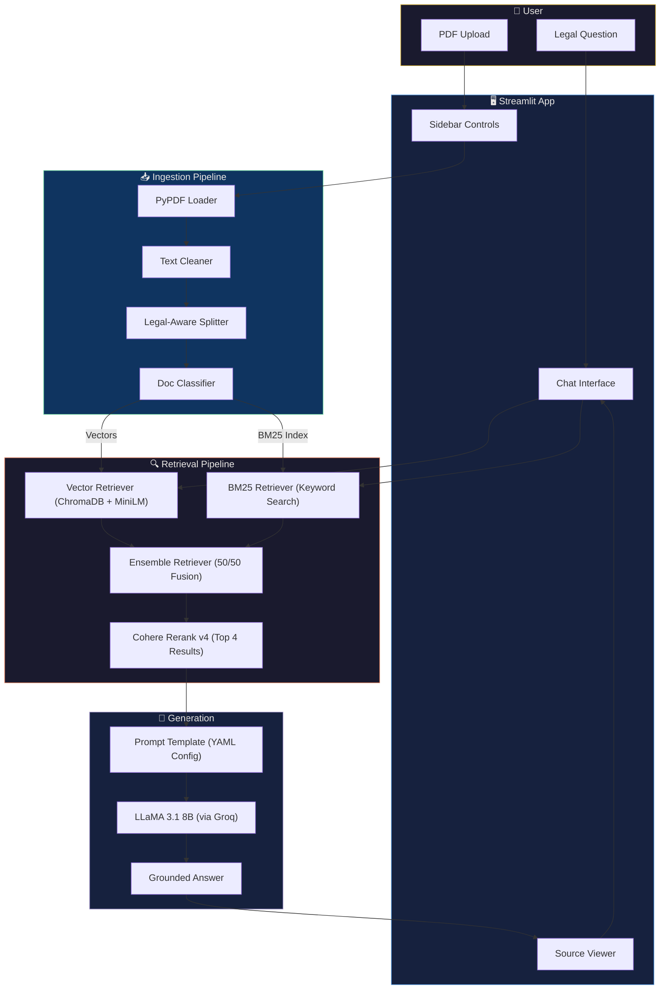
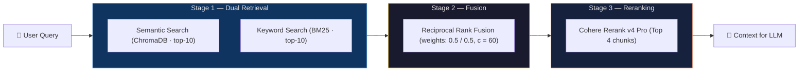
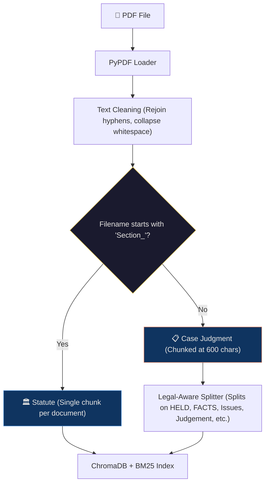
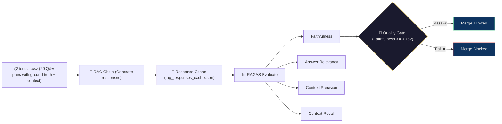

<p align="center">
  
  
  
  
  
</p>

# ⚖️ LegalEase

**A production-grade RAG system for Indian legal case law — powered by hybrid retrieval, neural reranking, and automated quality evaluation.**

LegalEase helps legal professionals, law students, and researchers query Indian court judgments and statutory provisions using natural language. It retrieves relevant legal passages, reranks them for precision, and generates grounded answers with full source citations.

---

## ✨ Features at a Glance

| Feature | Description |
|---|---|
| 🔍 **Hybrid Search** | Combines semantic (vector) + keyword (BM25) retrieval for best recall |
| 🏆 **Neural Reranking** | Cohere Rerank v4 re-scores results to surface the most relevant chunks |
| 📄 **Live Document Upload** | Upload PDFs via the sidebar — auto-ingested into the knowledge base |
| 🏛️ **Statute vs. Case Tagging** | Documents auto-classified as `Statute` or `Case` with visual badges |
| 🎛️ **Prompt Versioning** | 5 built-in prompt personas + custom prompt mode |
| 📊 **RAGAS Evaluation** | Automated faithfulness, relevancy, precision & recall scoring |
| 🔄 **CI/CD Quality Gate** | GitHub Actions pipeline that blocks merges if faithfulness drops |
| 💬 **Chat Interface** | Streamlit-powered conversational UI with source transparency |

---

## 🏗️ System Architecture



---

## 🔄 Retrieval Pipeline — Deep Dive

The retrieval strategy uses a **three-stage pipeline** to maximize both recall and precision:



| Stage | What it Does | Why it Matters |
|---|---|---|
| **Dual Retrieval** | Runs both vector similarity and BM25 keyword search in parallel | Captures both semantic meaning *and* exact legal terminology |
| **Ensemble Fusion** | Merges results using Reciprocal Rank Fusion (RRF) | Balances recall across both retrieval paradigms |
| **Neural Reranking** | Cohere's cross-encoder re-scores all candidates | Pushes the most contextually relevant chunks to the top |

---

## 📥 Document Ingestion

Documents are processed differently based on their type:



- **Statutes** (e.g., `Section_138_in_The_Negotiable_Instruments_Act_1881.PDF`) → stored as a single chunk to preserve statutory context
- **Case Judgments** → split using a legal-aware chunking strategy that respects judgment structure (`HELD`, `FACTS`, `Issues`, `Ratio`, etc.)

---

## 🎛️ Prompt Versioning System

LegalEase ships with **5 prompt versions**, each tailored for a different legal research task. Prompts are managed via `prompts.yaml` and selectable from the sidebar.

| Version | Persona | Best For |
|---|---|---|
| `v1` ⭐ | Friendly Explanatory Assistant | General legal Q&A — accessible language + Key Takeaway |
| `v2` | Contract Risk Analyst | Contract review — obligations, liabilities, risk factors |
| `v3` | Case Law Researcher | Case analysis — Facts, Issues, Holding, Reasoning |
| `v4` | Regulatory Compliance Officer | Statute interpretation — element breakdowns, exceptions |
| `v5` | Legal Drafting Assistant | Memo drafting — inline citations, formal legal tone |

> **Custom Prompt Mode:** Toggle on "Custom prompt mode" in the sidebar to write your own system prompt. Include `{context}` where retrieved documents should be injected.

---

## 📊 Evaluation Pipeline

LegalEase includes a rigorous evaluation framework using [RAGAS](https://docs.ragas.io/) with a curated test set of **20 questions** covering NI Act sections and landmark case law.



| Metric | What it Measures |
|---|---|
| **Faithfulness** | Are claims in the answer supported by the retrieved context? |
| **Answer Relevancy** | Does the answer address the user's question? |
| **Context Precision** | Are the retrieved chunks relevant to the question? |
| **Context Recall** | Does the retrieved context cover the ground-truth answer? |

### CI/CD Integration

A GitHub Actions workflow runs the evaluation pipeline on every pull request to `main`:

```yaml
# .github/workflows/evaluate.yml
on:
  pull_request:
    branches: [main]
  workflow_dispatch:
```

If **faithfulness** drops below **0.75**, the pipeline exits with code `1` — blocking the merge.

---

## 🛠️ Tech Stack

| Layer | Technology | Purpose |
|---|---|---|
| **LLM** | LLaMA 3.1 8B Instant (via [Groq](https://groq.com)) | Fast inference for answer generation |
| **Embeddings** | `all-MiniLM-L6-v2` (HuggingFace) | Document and query embedding |
| **Vector Store** | ChromaDB | Persistent vector storage and similarity search |
| **Keyword Search** | BM25 (`rank-bm25`) | Term-frequency based retrieval |
| **Reranker** | Cohere Rerank v4 Pro | Cross-encoder reranking |
| **Framework** | LangChain | Orchestration of chains and retrievers |
| **Frontend** | Streamlit | Chat UI with sidebar controls |
| **Evaluation** | RAGAS | Automated RAG quality metrics |
| **CI/CD** | GitHub Actions | Evaluation pipeline on PRs |
| **Document Parsing** | PyPDF | PDF loading and page extraction |

---

## 🚀 Quick Start

### Access the Deployed App:
 
- https://legelease.streamlit.app/

### Prerequisites

- Python 3.11+
- [Groq API Key](https://console.groq.com) (free tier available)
- [Cohere API Key](https://dashboard.cohere.com) (free tier available)

### 1. Clone & Install

```bash
git clone https://github.com/<your-username>/legalease.git
cd legalease

python -m venv venv
source venv/bin/activate   # macOS / Linux
# venv\Scripts\activate    # Windows

pip install -r requirements.txt
```

### 2. Configure Environment

```bash
cp .env.example .env
```

Edit `.env` and add your API keys:

```env
GROQ_API_KEY=your_groq_api_key_here
COHERE_API_KEY=your_cohere_api_key_here
```

### 3. Ingest Documents

Place your PDF files in the `data/` directory, then run:

```bash
python ingest_data.py
```

> The project ships with Indian NI Act sections (134–147) and several landmark Supreme/High Court judgments pre-loaded in `data/`.

### 4. Launch the App

```bash
streamlit run app.py
```

The app will open at `http://localhost:8501` with the custom dark theme applied automatically.

### 5. Run Evaluation (Optional)

```bash
python evaluate.py
```

Results are saved to `evaluation_results.csv`.

---

## 📁 Project Structure

```
legalease/
├── app.py                  # Streamlit chat UI
├── main.py                 # CLI interface for RAG chain
├── ingest_data.py          # Document loading, cleaning, chunking & indexing
├── retriever.py            # Hybrid retriever + Cohere reranker
├── evaluate.py             # RAGAS evaluation pipeline
├── prompts.yaml            # Prompt version configs (v1–v5)
├── testset.csv             # 20 curated evaluation Q&A pairs
├── requirements.txt        # Python dependencies
├── .env.example            # API key template
├── .streamlit/
│   └── config.toml         # Custom dark theme (navy + gold)
├── .github/
│   └── workflows/
│       └── evaluate.yml    # CI/CD evaluation pipeline
├── data/                   # PDF documents (statutes + case law)
├── chroma_db/              # ChromaDB persistent storage
└── bm25_retriever.pkl      # Serialized BM25 index
```

---

## 📜 Knowledge Base

The project ships with a curated corpus focused on **cheque dishonour law** under the Negotiable Instruments Act, 1881:

**Statutes** (14 sections)
- Sections 134–147 of the NI Act, including the critical Section 138 (cheque dishonour offence)

**Case Law** (12 landmark judgments)
- *Rangappa vs Sri Mohan* (2010) — Section 139 presumption scope
- *Dashrath Rupsingh Rathod vs State of Maharashtra* (2014) — Territorial jurisdiction
- *Icon Buildcon vs Aggarwal Developers* (2014) — Stop payment bona fides
- *Yogendra Pratap Singh vs Savitri Pandey* (2014)
- *M/S Laxmi Dyechem vs State of Gujarat* (2012)
- *Sony George Kurian vs State of Kerala* (2015)
- *Avneet Luthra vs Sunita Vijay* (2025) — Joint account holder liability
- And more...

---

## 📝 License

This project is for educational and research purposes.

---

<p align="center">
  <b>Built with ❤️ by Pyush Nandan</b>
</p>
